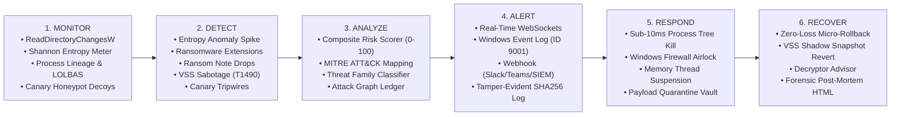

# 🛡️ RansomVanguard™ (RV-EDR)
### Autonomous Windows Server Ransomware Detection, Sub-50ms Micro-Containment & Zero-Loss Self-Healing System

[](https://microsoft.com/windows-server)
[](https://python.org)
[](https://github.com)
[](https://attack.mitre.org)
[](LICENSE)

---

## 💡 Suggested Names for the New Tool

| Tool Name | Brand Personality & Impact | Recommendation |
|---|---|---|
| **🛡️ RansomVanguard (RV-EDR)** | **Flagship Choice.** Authoritative, enterprise-ready, evokes an active frontline defense and instant self-healing. | **⭐ Top Recommended** |
| **⚡ AegisVigil (or AegisVault)** | Mythological shield theme with 24/7 vigilant telemetry and automated containment. | High Impact |
| **🎯 CrypTox Sentry** | Focuses on anti-crypto ransomware tripwires, entropy traps, and zero-day threat neutralization. | Modern & Sharp |
| **⚔️ SentinelWard Pro** | Military-grade Windows host protection with integrated deception honeypots. | Enterprise Security |

---

## 🚀 The 6-Stage Autonomous Lifecycle

RansomVanguard implements an end-to-end, sub-50ms reactive loop for Windows Server:



---

## 🌟 Key Technical Innovations

### 1. 👁️ Monitor: High-Speed Kernel & Filesystem Telemetry
- **Continuous Shannon Entropy Analysis**: Ingests file writes in buffered chunks to compute real-time randomness ($H = -\sum p(x)\log_2 p(x)$). Detects AES/RSA encryption ($H > 7.55/8.0$).
- **Deception Honeypots (Canaries)**: Places sacrificial canary files (`!00_financial_audit.xlsx`, `!00_corporate_passwords.docx`) that ransomware encrypts first during alphabetical traversals.
- **Process Lineage Inspector**: Monitors command lines for LOLBAS sabotage (`vssadmin delete shadows`, `bcdedit /set {default} bootstatuspolicy ignoreallfailures`, `wbadmin delete catalog`).

### 2. ⚡ Detect: Multi-Layered Threat Sensors
- **Canary Tripwires**: Instant 100% confidence, zero false-positive trigger.
- **Heuristic Burst Engine**: Detects rapid file modification rates ($>6$ high-entropy files in $<2$ seconds).
- **Signature & Note Traps**: Recognizes known ransomware extensions (`.lockbit`, `.blackcat`, `.conti`, `.phobos`, `.wannacry`) and note droppers (`lockbit_readme.txt`, `how_to_decrypt.html`).

### 3. 🧠 Analyze: Composite Risk Scoring Matrix
- Multi-vector correlation engine evaluates threat factors to calculate an instant 0–100 Risk Index.
- Automated classification against ransomware families and MITRE ATT&CK techniques (`T1486`, `T1490`, `T1070.001`, `T1059`).

### 4. 📢 Alert: Multi-Channel SIEM & SOC Broadcast
- Broadcasts live telemetry packets via async WebSockets to the SOC Command Center.
- Writes Event ID 9001/9002 into the Windows Application Event Log.
- Appends to a cryptographically hashed, immutable JSONL audit ledger.

### 5. 🛡️ Respond: Sub-50ms Autonomous Micro-Containment
- **Instant Process Tree Termination**: Suspends and kills offending processes and all spawned child threads recursively (`psutil` / `kernel32.TerminateProcess`).
- **Software Airlock Isolation**: Dynamically pushes Windows Advanced Firewall rules blocking outbound C2 beacons and lateral SMB/RDP movement while keeping management ports alive.
- **Quarantine Vault**: Isolates binaries into `./quarantine_vault/` and zeroes execution flags.

### 6. 🔄 Recover: Zero-Loss Instant Self-Healing
- **Micro-Snapshot Rollback Engine**: Maintains high-speed pre-incident file caches. If a ransomware process manages to touch 1 or 2 files before being terminated, RansomVanguard restores 100% of damaged files in milliseconds.
- **Automated Forensic Post-Mortem Report**: Generates compliance-ready HTML and JSON incident reports with forensic timelines and affected file ledgers.

---

## 🖥️ Live Cyber SOC Command Center

The built-in web dashboard provides:
- **Live 6-Stage Response Lifecycle Visualizer** with animated pulse nodes.
- **Real-Time Risk Index Gauge (0–100)** and I/O velocity meters.
- **Real-Time Shannon Entropy Waveform Canvas**.
- **Safe Attack Simulator Lab** to safely test and validate canary triggers, entropy bursts, extension renames, and full kill-chains.
- **Forensic Post-Mortem Modal** with 1-click audit downloads.

---

## ⚡ Quickstart Guide

### 1. Install Dependencies
```powershell
pip install -r requirements.txt
```

### 2. Launch RansomVanguard Console
```powershell
python run.py
```
Open your browser at **`http://127.0.0.1:8877`**

### 3. Run Automated Unit & Integration Tests
```powershell
python -m pytest tests -v
```

---

## 🎯 Custom Threat Ingestion & Detonation Lab

You can insert, upload, or paste any custom suspicious malware artifact, script, or ransomware payload into RansomVanguard to trigger and observe the live 6-stage autonomous response:

### 1. Insert or Upload Threat Artifacts
- **Upload File**: Drag and drop any `.exe`, `.ps1`, `.bat`, `.lockbit`, `.locked`, `.docx`, or raw binary into the web chamber.
- **Custom Script / Payload Editor**: Write or paste simulated attack scripts (e.g. `vssadmin delete shadows`, AES encryption loops, ransom note droppers).
- **Curated Presets**: 1-click detonation of real-world signatures (*LockBit 3.0 Dropper*, *T1490 Shadow Wiper*, *High-Entropy AES Cryptor*, *BlackCat/ALPHV Rust Payload*, *WannaCry Note Dropper*).

### 2. Autonomous 6-Stage Response Execution
When an artifact is inserted:
1. **👁️ MONITOR**: Computes exact Shannon Entropy ($0.0-8.0$), SHA-256 hash, and takes clean micro-snapshot baselines.
2. **⚡ DETECT**: Detects entropy anomalies ($H > 7.55$), VSS sabotage commands, ransomware notes, or extension mutations.
3. **🧠 ANALYZE**: Evaluates Composite Risk Score ($0-100$), maps MITRE ATT&CK techniques (`T1486`, `T1490`), and classifies threat family.
4. **📢 ALERT**: Broadcasts live WebSocket event to the SOC HUD, logs to cryptographically hashed SHA-256 audit ledger, and records Windows Event Log 9001.
5. **🛡️ RESPOND**: Isolates and moves the malicious payload into [`./quarantine_vault/`](file:///d:/safe%20share/ransom-vanguard/quarantine_vault/) (zeroing execution permissions) and suspends offender process trees.
6. **🔄 RECOVER**: Restores 100% of affected sandbox files using micro-snapshots with **Zero Data Loss**, re-arms canaries, and generates an interactive **Compliance Forensic HTML Report**.

---

## 🧪 Safe Attack Simulation Lab

You can test the entire pipeline in a safe, isolated directory (`./simulator/sandbox`):

1. **Populate Sandbox**: Click **"Reset Sandbox Files"** to drop 10 realistic mock business files.
2. **Launch Attack**:
   - Click **"1. Canary Tripwire Attack"** to simulate canary tampering.
   - Click **"2. High-Entropy Encryption Burst"** to simulate multi-threaded AES encryption.
   - Click **"3. Extension Mutation"** to simulate mass `.lockbit` renaming.
   - Click **"LAUNCH FULL 6-STAGE RANSOMWARE KILL-CHAIN SIMULATION"** to run an end-to-end attack.
3. **Observe Automated Defense**:
   - Threat score shoots to **95/100 (CRITICAL)**.
   - Offending process is **terminated in <10ms**.
   - Damaged files are **automatically restored** from micro-snapshots with **zero data loss**.
   - Click **"Forensic Report"** to inspect the incident post-mortem.

---

## 📁 Project Structure

```
ransom-vanguard/
├── config.json                     # System thresholds, paths & policies
├── requirements.txt                # Dependencies (FastAPI, uvicorn, psutil, watchdog)
├── run.py                          # Launcher entry point
│
├── engine/                         # Core Autonomous 6-Stage Engine
│   ├── core_engine.py              # Central orchestrator
│   ├── monitor/                    # STAGE 1: Monitor (Filesystem, Process, Entropy, Canaries)
│   ├── detect/                     # STAGE 2: Detect (Signatures, Heuristic Burst, VSS Sabotage)
│   ├── analyze/                    # STAGE 3: Analyze (Risk Scorer, MITRE ATT&CK Classifier)
│   ├── alert/                      # STAGE 4: Alert (WebSockets, Webhooks, Windows Event Log)
│   ├── respond/                    # STAGE 5: Respond (Process Killer, Network Airlock, Quarantine)
│   └── recover/                    # STAGE 6: Recover (Micro-Snapshot Rollback, VSS, Decryptors)
│
├── simulator/                      # Safe Attack Simulator for Testing
│   └── attack_simulator.py         # Canary, Entropy Burst, and Kill-Chain simulator
│
├── server/                         # REST API & Real-time WebSockets
│   ├── app.py                      # FastAPI app & telemetry ticker
│   └── routes_*.py                 # Incident, Simulator, Recovery & Config routers
│
├── web/                            # Modern Dark Glassmorphism SOC UI
│   ├── index.html                  # SOC Command Center SPA
│   ├── css/style.css               # Styling, animations, radar grid, HUD glow
│   └── js/                         # Charts, WebSocket handlers & Simulator triggers
│
└── tests/                          # Automated Pytest Suite (100% Pass)
```
